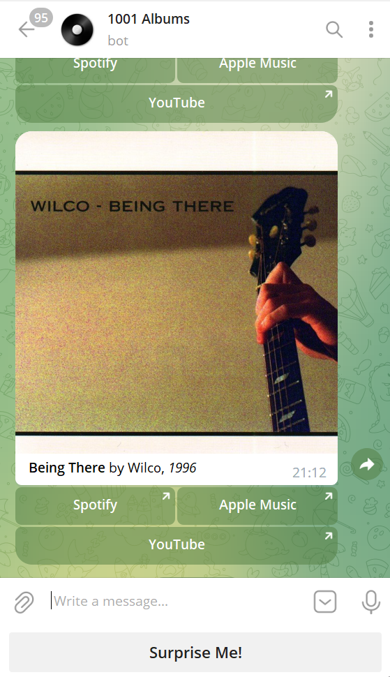

# music-album-advisor

## About

The music-album-advisor is a Telegram bot that offers a random music album from its internal database.
The bot can display album covers and generate links to the proposed album in the main streaming services.

Supported streaming platforms: Apple Music, Spotify, YouTube.

## Who Use It

[1001 Albums](https://t.me/albums1001bot) - The Telegram bot that offers to listen to a random album from the list of ["1001 Albums You Must Hear Before You Die"](https://en.wikipedia.org/wiki/1001_Albums_You_Must_Hear_Before_You_Die) book.

## How to Contribute

1. Clone the repo and create a new branch: `$ git checkout git@github.com:nbbrdn/music-album-advisor.git -b name_for_new_branch`.
2. Make changes and test.
3. Submit Pull Request with comprehensive description of changes.

## Donations

This is free, open-source software. If you'd like to support the development of future projects, or say thanks for this one, you can donate BTC at `7DDa8hRRNUtUavngswUD44dsFNezYLX5y9`.

## License

[MIT](LICENSE)
